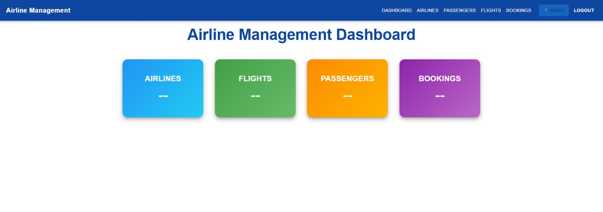
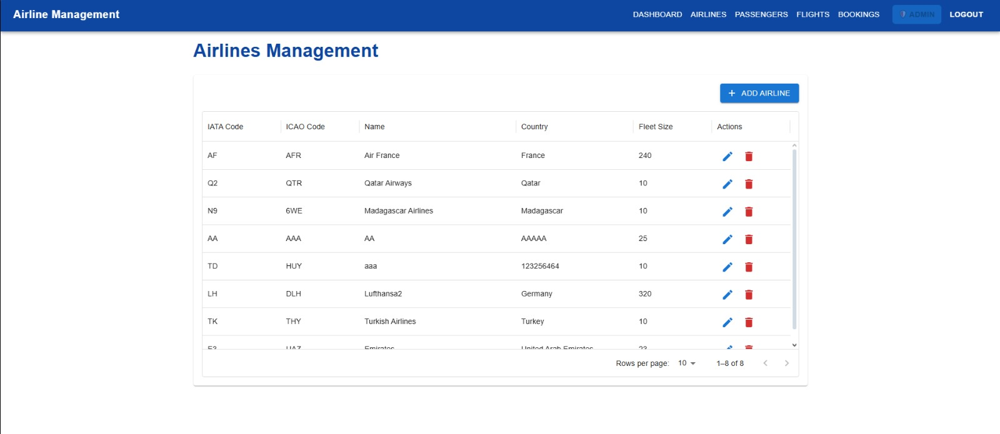
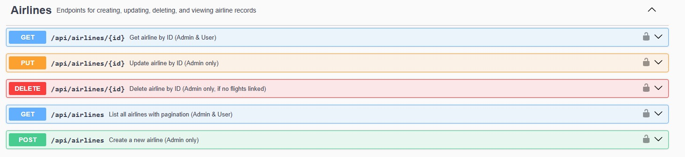
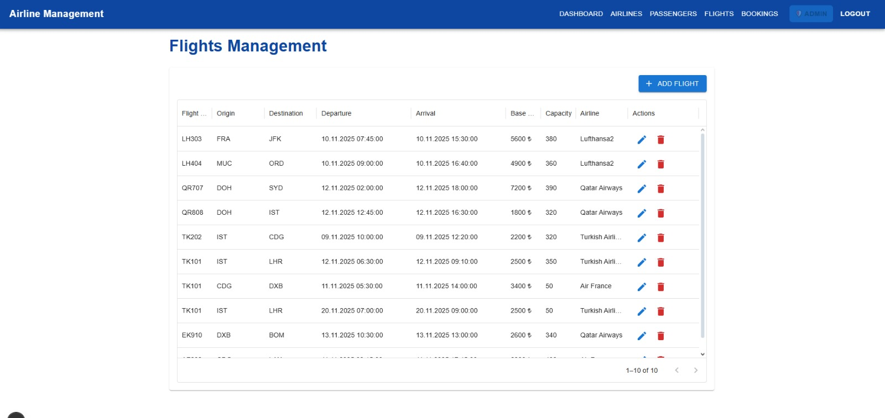
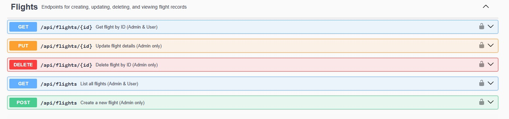
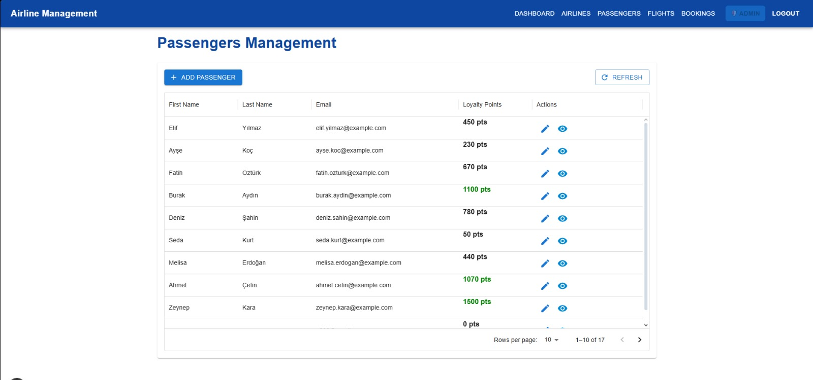
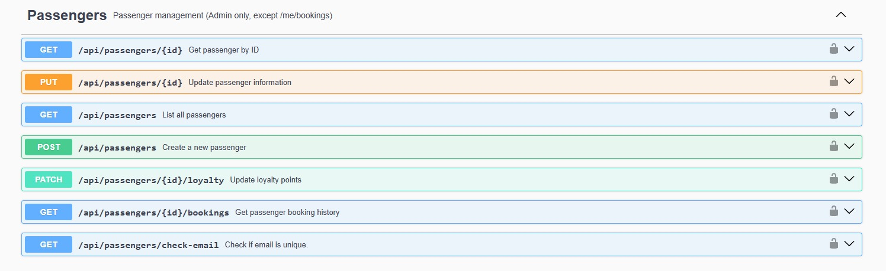
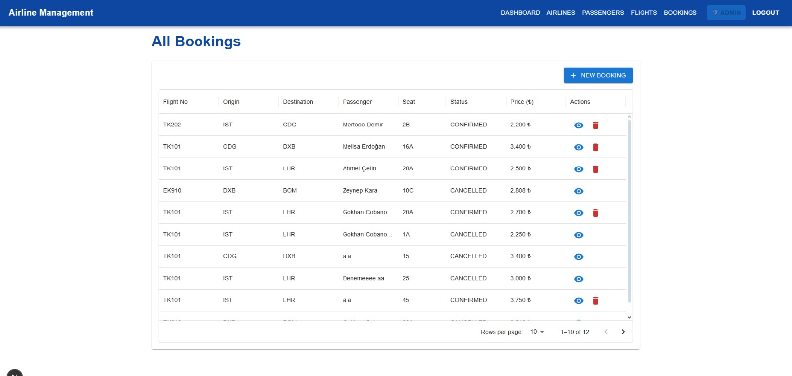
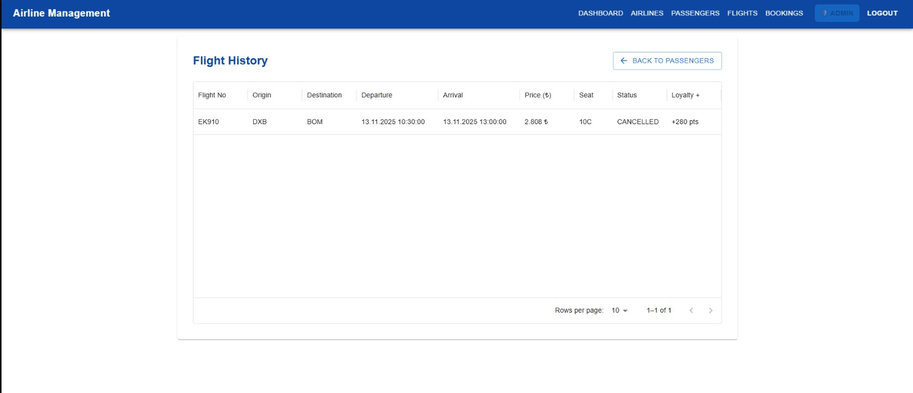
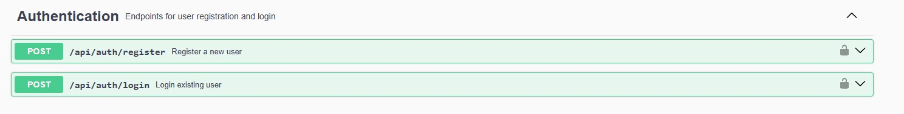

# 🛫 Airline Management System

**Airline Management System** is a full-stack web application built to manage all core airline operations — including flights, passengers, bookings, and airlines.  
It features **role-based authentication**, separating privileges between **Admin** and **User** roles.

---

## 🚀 Features

### 👨‍✈️ Admin Capabilities
- Manage **Airlines**, **Flights**, **Passengers**, and **Bookings**
- View, edit, and cancel any booking
- Update loyalty points for passengers
- Dynamic pricing based on flight occupancy
- Role-based access control (JWT)
- Validation and global exception handling

### 👤 User Capabilities
- Register and log in (JWT authentication)
- Browse available flights
- Create and cancel flight bookings
- View personal booking history
- Earn loyalty points on confirmed flights

---

## 🧩 Architecture Overview

### ⚙️ Backend (Spring Boot)
- **Java 21 / Spring Boot 3**
- Layered architecture:
  - `controller` – REST API endpoints  
  - `service` – Business logic layer  
  - `repository` – JPA data access layer  
  - `entity` – Database models  
  - `dto` – Data transfer objects  
  - `mapper` – MapStruct for entity-DTO conversion  
  - `exception` – Centralized error handling  
  - `security` – JWT-based authentication  
  - `util` – Utilities (DateUtils, PriceCalculator)
- **PostgreSQL** database
- Uses **Lombok**, **MapStruct**, **Spring Security**, and **Validation**
- **JUnit 5 + Mockito** for unit testing

### 💻 Frontend (Next.js + TypeScript + MUI)
- **Next.js 14 (App Router)**
- **TypeScript** + **Material UI (MUI)** for modern design
- Fully responsive and role-aware interface
- Axios-based API service layer
- Snackbar notifications for user feedback
- Dynamic pages:
  - `/airlines`
  - `/flights`
  - `/bookings`
  - `/passengers`

---

## 🧱 Tech Stack

| Layer | Technologies |
|--------|--------------|
| Backend | Java 21, Spring Boot, JPA, Lombok, MapStruct, Spring Security |
| Database | PostgreSQL |
| Frontend | Next.js, TypeScript, Material UI |
| Testing | JUnit 5, Mockito |
| Others | Docker, Swagger (OpenAPI Docs), Axios |

---

## 🛠️ Installation Guide

### 1️⃣ Backend Setup

```bash
cd backend
mvn clean install
```

Create an .env file with your configuration:

```bash
DB_URL=jdbc:postgresql://localhost:5432/airline_management
DB_USERNAME=postgres
DB_PASSWORD=yourpassword
JWT_SECRET=your_secret_key
```

Run the server:

```bash
mvn spring-boot:run
```

Swagger UI:

```bash
http://localhost:8080/swagger-ui/index.html
```

### 2️⃣ Frontend Setup

```bash
cd frontend
npm install
```

Create .env.local:

```env
NEXT_PUBLIC_API_URL=http://localhost:8080/api
```

Run the app:

```bash
npm run dev
```

Frontend available at:

```bash
http://localhost:3000
```

---

## 📸 Screenshots

Below are some preview images from the **Airline Management System** showcasing both the frontend and backend features.

---

### 🧭 Admin Dashboard
An overview panel for administrators to manage all airline operations.


---

### ✈️ Airlines Management
Admin can view, create, and edit airlines.



---

### 🛫 Flights Management
List, edit, and schedule flights with full CRUD functionality.



---

### 👥 Passenger Management
Admin view to manage passenger data and loyalty points.



---

### 📅 Booking Management
Admins can manage all flight bookings and view booking details.



---

### 📖 Flight History (Per Passenger)
Admin view showing a passenger’s full flight history and loyalty gains.


---

### 🔐 Authentication & Security
JWT-based authentication flow for login, registration, and authorization.



## 👥 Roles and Permissions

The system includes **two main roles** with distinct access levels:  
**ADMIN** and **USER**.

---

### 🛡️ ADMIN ROLE

Administrators have full access to manage all resources in the system.  
They are responsible for maintaining airline data, flights, passengers, and bookings.

| Feature | Description | Access |
|----------|--------------|--------|
| 🏢 **Airlines** | Create, edit, and delete airlines | ✅ Full |
| ✈️ **Flights** | Manage flights (CRUD operations) | ✅ Full |
| 👤 **Passengers** | Manage passenger records and loyalty points | ✅ Full |
| 📅 **Bookings** | View all bookings, cancel any booking, manage seat assignments | ✅ Full |
| 🔍 **Flight History** | View all passengers’ flight histories | ✅ Full |
| ⚙️ **Dashboard** | Access admin dashboard with full statistics | ✅ Full |
| 🔐 **Authentication** | Login with ADMIN role credentials | ✅ Full |

---

### 👤 USER ROLE

Users have limited access to view and manage their own flight bookings only.  
They cannot view or modify other users’ data.

| Feature | Description | Access |
|----------|--------------|--------|
| ✈️ **Flights** | View available flights | ✅ Read Only |
| 📅 **Bookings** | Create, view, and cancel *own* bookings | ✅ Limited |
| 💳 **Loyalty Points** | Earn points automatically from completed flights | ✅ Auto-managed |
| 🧾 **Booking Details** | View details of own bookings | ✅ Limited |
| 👥 **Passengers** | Cannot access passenger management | 🚫 No Access |
| 🏢 **Airlines** | Cannot manage airlines | 🚫 No Access |
| ⚙️ **Dashboard** | No access to admin dashboard | 🚫 No Access |

---

### 🔒 Access Summary

| Module | Admin | User |
|:----------------|:-------:|:-------:|
| **Airlines** | ✅ | 🚫 |
| **Flights** | ✅ | ✅ (read-only) |
| **Passengers** | ✅ | 🚫 |
| **Bookings** | ✅ | ✅ (own only) |
| **Flight History** | ✅ | 🚫 |
| **Loyalty Points** | ✅ | ✅ (auto) |
| **Authentication** | ✅ | ✅ |

---

## 🧑‍💻 Author

**Gökhan Çobanoğlu**  
📧 [gkhancobanoglu@gmail.com](mailto:gkhancobanoglu@gmail.com)  
📞 +90 544 523 9802  
🌐 [gokhancobanoglu.com.tr](https://gokhancobanoglu.com.tr)  
💼 [LinkedIn](https://www.linkedin.com/in/gokhan-cobanoglu) • [GitHub](https://github.com/gkhancobanoglu)
